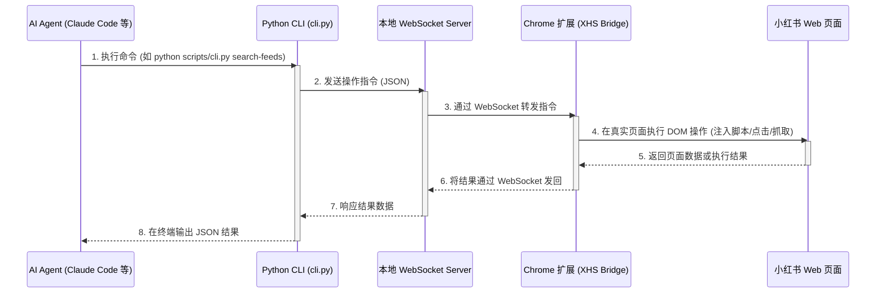

# xiaohongshu-skills 架构说明

本项目采用了 **Extension Bridge 模式**，旨在让 AI Agent 能够安全、稳定地在用户真实的浏览器与小红书账号下进行自动化操作。

## 架构图

## 核心组件说明

### 1. 统一入口 (`scripts/cli.py`)
- AI Agent 与本项目交互的**唯一**入口。
- 将复杂的 Python 内部调用封装为了清晰明了的命令行参数（`--keyword`, `--feed-id` 等）。
- 接收参数后，连接本地的 WebSocket 服务来派发任务。
- 将最终结果以严格的 JSON 格式输出给 Agent。

### 2. 本地 WebSocket 服务 (`scripts/bridge_server.py`)
- 扮演消息总线的角色，监听在本地端口（默认 `9333`）。
- 负责协调 CLI 端（指令发送方）和 Chrome 扩展端（指令执行方）。
- 当 CLI 请求时，它会唤起或等待 Chrome 扩展连接。

### 3. Chrome 扩展 (XHS Bridge) (`extension/`)
- 本项目的核心精髓。不同于通过 Selenium / Playwright 等自动化工具启动一个隐身 / 干净环境的浏览器（这极易触发各大厂的反爬和风控机制）。
- 扩展安装在用户**日常使用的真实 Chrome 浏览器**中。
- 它共享用户完全真实的登录状态、指纹信息。以用户的身份，在真实的已登录的小红书标签页内完成自动化操作（如注入 `xhs/...` 下的代码进行元素发现和点击）。

## 为什么使用 Bridge 模式？

1. **绝对的账号安全**：所有操作都在你的真实浏览器环境发生，行为模式与普通用户极大贴近，彻底避免了传统无头浏览器（Headless Browser）或纯接口请求被识别并封号的风险。
2. **免除复杂的凭证管理**：不需要手动复制 Cookie 或配置任何复杂的 Token 文件，只需平时怎样登录就怎样登录，安装好扩展后，Agent 直接继承登录态。
3. **可见的操作过程**：所有自动化操作（点赞、输入评论、发布图文）都会在你眼前的浏览器标签页中真实进行，你随时可以介入或停止。
