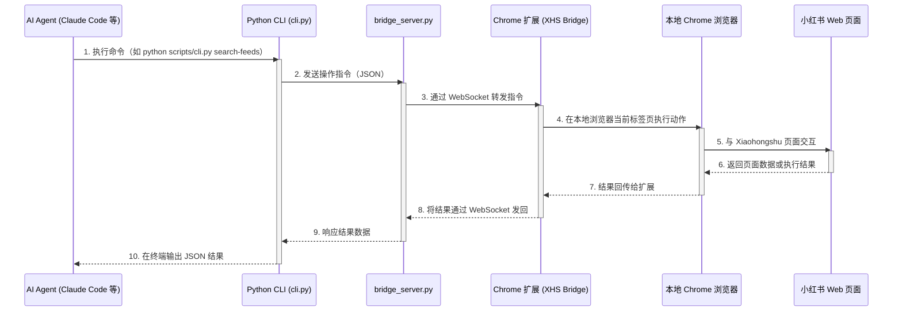

# xiaohongshu-skills 架构说明

本项目采用 **Extension Bridge 模式**，让 AI Agent 在用户真实的浏览器与小红书账号下完成自动化操作，同时把发布、长文、多账号等流程统一收口到本地 CLI。

## 架构图



## 端到端链路

```text
Claude Code / 其他兼容 Agent
  -> scripts/cli.py
  -> scripts/bridge_server.py
  -> extension/ (XHS Bridge)
  -> 本地 Chrome 浏览器
  -> Xiaohongshu Web
```

Bridge 模式的关键点是：CLI 只负责发送结构化指令，真正的点击、输入、抓取都发生在用户本机浏览器和真实登录态里，而不是远程托管浏览器或无头环境。

## 核心组件说明

### 1. 统一入口 (`scripts/cli.py`)
- AI Agent 与本项目交互的唯一入口。
- 把内部能力封装为清晰的子命令和参数，如 `search-feeds`、`fill-publish`、`long-article`。
- 负责连接本地 Bridge、校验输入文件、输出 JSON 结果。
- 发布类流程在这里统一收口，避免子技能直接绕过 CLI 执行浏览器动作。

### 2. 本地通信服务 (`scripts/bridge_server.py`)
- 扮演消息总线角色，监听本地端口并维护 CLI 与扩展之间的通信。
- 协调命令请求、超时、扩展连接状态。
- 是 Bridge 模式中的中继节点，不直接操作 Xiaohongshu 页面。

### 3. Chrome 扩展 (XHS Bridge) (`extension/`)
- 安装在用户真实使用的 Chrome 中。
- 共享用户当前浏览器环境、登录态和可见页面。
- 在指定标签页里执行 DOM 查询、输入、点击、抓取等动作，并把结果回传给 bridge server。

### 4. Xiaohongshu 页面执行层
- 搜索、详情、互动、发布都在小红书真实页面上完成。
- 发布页分为图文 / 视频 / 长文等不同分支，扩展根据 CLI 指令进入对应页面流转。

## Bridge 模式为什么适合这个项目

1. **真实浏览器执行**：所有动作都发生在用户本机 Chrome 中，贴近真实用户行为。
2. **本地登录态复用**：无需额外导出 token，Bridge 直接复用当前登录态。
3. **可见可控**：用户能看到发布、评论、模板选择等实际操作过程。
4. **便于多账号隔离**：多账号切换可以基于不同登录态、cookies 或浏览器会话分开管理，而不是在一个远程自动化上下文里混用。

## 关键业务流

### 发布流

- 普通图文发布支持一步发布，也支持 `fill-publish -> click-publish` 的分步预览路径。
- 用户取消正式发布时，走 `save-draft` 保存草稿，而不是直接关闭页面。
- 图文发布只接受用户已准备好的本地图片绝对路径；本仓库不负责生成、提取或下载图片。

### 长文流

- 长文通过 `long-article` 进入专门的长文编辑器分支。
- 进入长文页后，会继续经历模板选择与后续描述填写流程，对应 `select-template`、`next-step` 等命令。
- 这条路径与普通图文发布不同，文档和技能都应明确区分。

### 多账号流

- 多账号不是在同一份登录态上强切逻辑身份，而是通过清理 cookies、重新登录或不同本地会话来完成隔离。
- `xhs-auth` 负责登录检查、退出、切换等入口；发布、互动、搜索默认使用当前活跃账号。

### copy-ready 系列发布边界

- 系列内容在运营编排阶段可以经过选题、写作、润色、草稿整理等多个中间产物。
- 一旦内容已经收口为可直接发布的终稿，发布阶段应只认单一 `copy-ready` Markdown 作为最终真源，再由 `xhs-publish` 执行填充、预览、发布。
- 这里的 `copy-ready` 是发布阶段的内容治理规则与工作流边界，不表示当前 CLI 已经提供单独的 `copy-ready` 子命令、专门命令面或机器可直接消费的发布接口。
